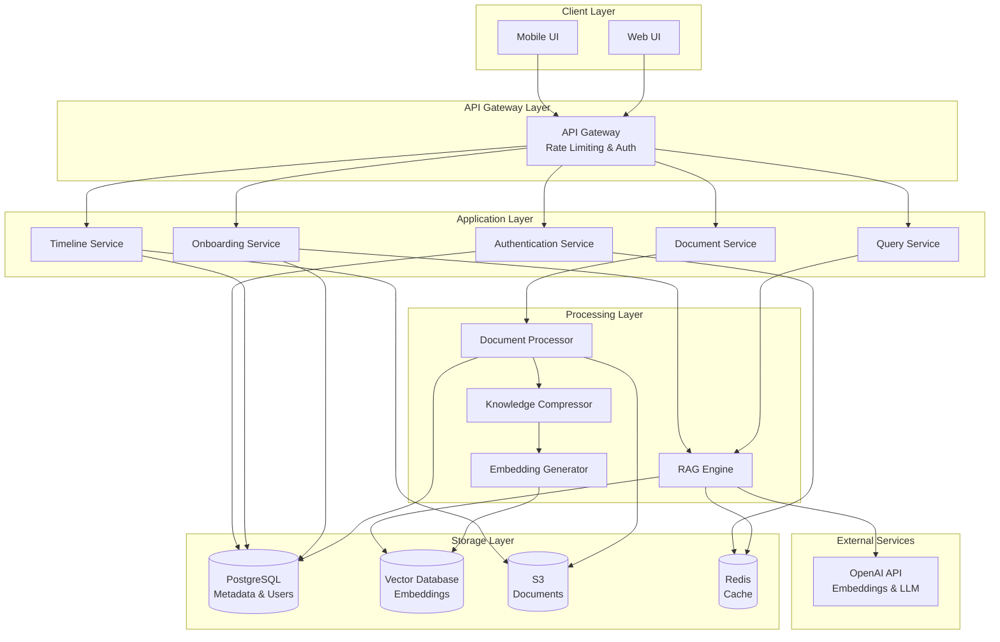
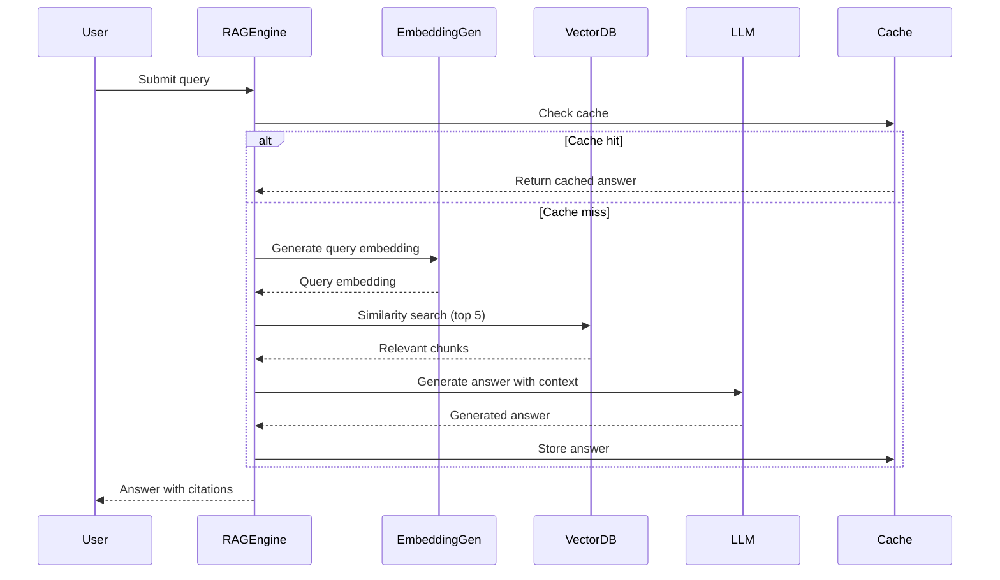
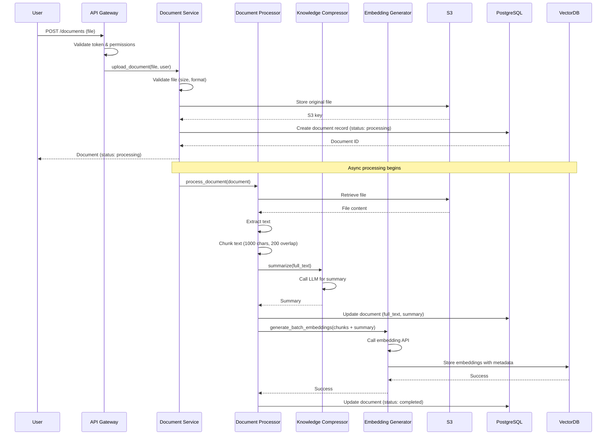
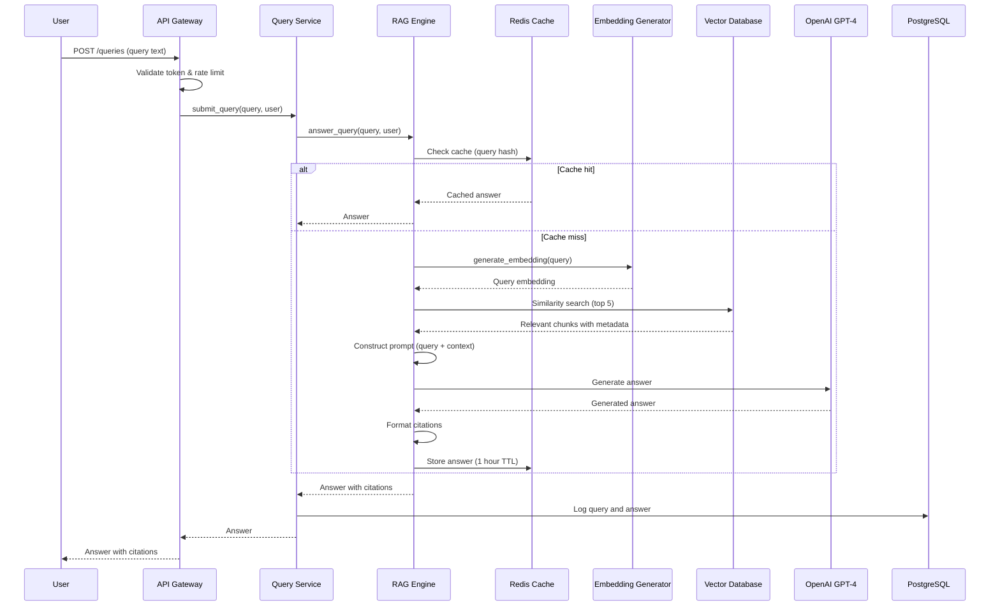
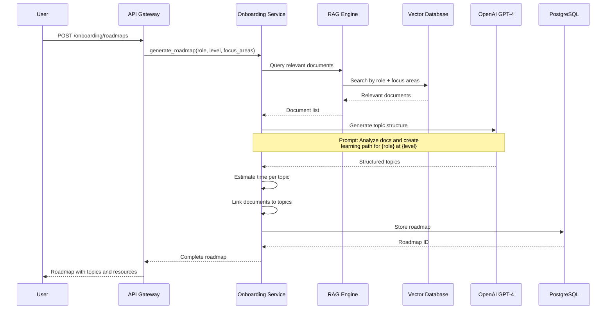
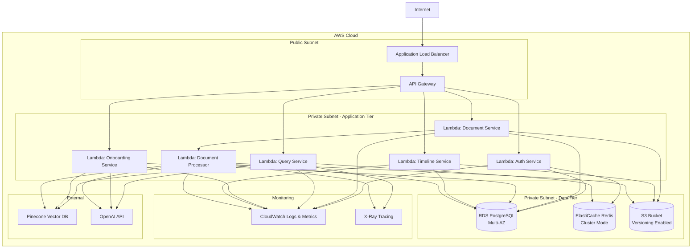

# Design Document: AI Project Brain

## Overview

The AI Project Brain is an organizational memory system built on a Retrieval-Augmented Generation (RAG) architecture. The system ingests project documents, converts them into searchable embeddings, and uses large language models to provide contextual answers to natural language queries. The architecture follows a microservices pattern with clear separation between document processing, storage, retrieval, and generation components.

### Key Design Principles

1. **Modularity**: Each component has a single, well-defined responsibility
2. **Scalability**: Horizontal scaling for all stateless components
3. **Security**: Defense-in-depth with encryption, authentication, and authorization at every layer
4. **Performance**: Sub-5-second query response times through caching and optimization
5. **Maintainability**: Clear interfaces and comprehensive documentation

### Technology Stack

- **Backend**: Python 3.11+ with FastAPI framework
- **Vector Database**: Pinecone or Weaviate for embedding storage
- **Embedding Model**: OpenAI text-embedding-3-large or sentence-transformers
- **LLM**: OpenAI GPT-4 or Anthropic Claude for answer generation
- **Document Processing**: PyPDF2, python-docx, markdown libraries
- **Authentication**: JWT tokens with OAuth 2.0
- **Database**: PostgreSQL for metadata and user management
- **Cache**: Redis for query caching and session management
- **Cloud Platform**: AWS (Lambda, S3, RDS, ElastiCache)
- **API Gateway**: AWS API Gateway with rate limiting
- **Monitoring**: CloudWatch, Prometheus, Grafana

## Architecture

### High-Level Architecture




### Component Architecture

The system is organized into five primary layers:

1. **Client Layer**: Web and mobile interfaces for user interaction
2. **API Gateway Layer**: Single entry point with authentication, rate limiting, and routing
3. **Application Layer**: Business logic services exposing REST APIs
4. **Processing Layer**: Core AI/ML components for document processing and query handling
5. **Storage Layer**: Persistent storage for documents, embeddings, metadata, and cache


## Components and Interfaces

### 1. Authentication Service

**Responsibility**: Manage user authentication, authorization, and session management.

**Interfaces**:

```python
class AuthenticationService:
    def login(username: str, password: str) -> AuthToken:
        """Authenticate user and return JWT token"""
        
    def logout(token: AuthToken) -> bool:
        """Invalidate session token"""
        
    def validate_token(token: AuthToken) -> User:
        """Verify token and return user details"""
        
    def check_permission(user: User, resource: str, action: str) -> bool:
        """Verify user has permission for action on resource"""
        
    def create_user(username: str, password: str, role: Role) -> User:
        """Create new user account (Admin only)"""
        
    def update_user_role(user_id: str, new_role: Role) -> User:
        """Update user role (Admin only)"""
```

**Key Design Decisions**:
- JWT tokens for stateless authentication with 24-hour expiration
- Redis for token blacklist (logout) and rate limiting
- Bcrypt for password hashing with salt rounds = 12
- Role-based access control (RBAC) with three roles: Developer, Manager, Admin

### 2. Document Service

**Responsibility**: Handle document upload, storage, and retrieval.

**Interfaces**:

```python
class DocumentService:
    def upload_document(file: UploadFile, user: User) -> Document:
        """Upload and process new document"""
        
    def get_document(document_id: str, user: User) -> Document:
        """Retrieve document by ID with access control"""
        
    def list_documents(filters: DocumentFilters, user: User) -> List[Document]:
        """List documents with filtering and pagination"""
        
    def delete_document(document_id: str, user: User) -> bool:
        """Delete document and associated data"""
        
    def search_documents(query: str, filters: DocumentFilters, user: User) -> List[Document]:
        """Search documents by keyword"""
```

**Key Design Decisions**:
- Asynchronous processing pipeline: upload → extract → summarize → embed
- Original documents stored in S3 with versioning enabled
- Metadata stored in PostgreSQL for fast filtering and search
- Maximum file size: 50MB
- Supported formats: PDF, DOCX, TXT, MD


### 3. Document Processor

**Responsibility**: Extract text from uploaded documents and coordinate processing pipeline.

**Interfaces**:

```python
class DocumentProcessor:
    def extract_text(file: UploadFile) -> str:
        """Extract text content from document file"""
        
    def validate_document(file: UploadFile) -> ValidationResult:
        """Validate file format and size"""
        
    def chunk_text(text: str, chunk_size: int = 1000, overlap: int = 200) -> List[TextChunk]:
        """Split text into overlapping chunks for embedding"""
        
    def process_document(document: Document) -> ProcessingResult:
        """Orchestrate full document processing pipeline"""
```

**Key Design Decisions**:
- Text chunking with 1000-character chunks and 200-character overlap for context preservation
- Format-specific extractors: PyPDF2 for PDF, python-docx for DOCX, direct read for TXT/MD
- Error handling with retry logic for transient failures
- Processing status tracking in PostgreSQL

### 4. Knowledge Compressor

**Responsibility**: Generate concise summaries of document content using LLM.

**Interfaces**:

```python
class KnowledgeCompressor:
    def summarize(text: str, max_words: int = 500) -> Summary:
        """Generate summary of document text"""
        
    def extract_key_concepts(text: str) -> List[Concept]:
        """Identify key concepts and terminology"""
        
    def extract_decisions(text: str) -> List[Decision]:
        """Extract decision points and rationale"""
        
    def extract_action_items(text: str) -> List[ActionItem]:
        """Identify action items and tasks"""
```

**Key Design Decisions**:
- Use GPT-4 with structured prompts for consistent summarization
- Maximum summary length: 500 words
- Preserve technical terminology and acronyms
- Extract structured metadata (concepts, decisions, actions) for enhanced search
- Fallback to extractive summarization if LLM fails


### 5. Embedding Generator

**Responsibility**: Convert text into vector embeddings for semantic search.

**Interfaces**:

```python
class EmbeddingGenerator:
    def generate_embedding(text: str) -> Embedding:
        """Generate embedding vector for text"""
        
    def generate_batch_embeddings(texts: List[str]) -> List[Embedding]:
        """Generate embeddings for multiple texts efficiently"""
        
    def store_embedding(embedding: Embedding, metadata: dict) -> str:
        """Store embedding in vector database with metadata"""
        
    def update_embedding(embedding_id: str, embedding: Embedding) -> bool:
        """Update existing embedding"""
```

**Key Design Decisions**:
- Use OpenAI text-embedding-3-large (3072 dimensions) for high-quality embeddings
- Batch processing for efficiency (up to 100 texts per API call)
- Store embeddings with metadata: document_id, chunk_index, upload_date, uploader
- Normalize embeddings for cosine similarity search
- Cache embeddings in Redis for frequently accessed documents

### 6. RAG Engine

**Responsibility**: Implement Retrieval-Augmented Generation for contextual Q&A.

**Interfaces**:

```python
class RAGEngine:
    def answer_query(query: str, user: User) -> Answer:
        """Generate answer to user query with citations"""
        
    def retrieve_context(query_embedding: Embedding, top_k: int = 5) -> List[Context]:
        """Retrieve most relevant document chunks"""
        
    def generate_answer(query: str, context: List[Context]) -> str:
        """Generate natural language answer using LLM"""
        
    def format_citations(context: List[Context]) -> List[Citation]:
        """Format source citations for answer"""
```

**RAG Pipeline Flow**:



**Key Design Decisions**:
- Retrieve top 5 most similar chunks (configurable)
- Use cosine similarity for vector search
- Construct prompt with query + retrieved context + instructions
- Include source citations with document name and chunk reference
- Cache query-answer pairs in Redis (1-hour TTL)
- Implement fallback response when no relevant context found
- Maximum context window: 8000 tokens for GPT-4


### 7. Query Service

**Responsibility**: Handle user queries and coordinate RAG pipeline.

**Interfaces**:

```python
class QueryService:
    def submit_query(query: str, user: User) -> QueryResponse:
        """Process user query and return answer"""
        
    def get_query_history(user: User, limit: int = 50) -> List[Query]:
        """Retrieve user's query history"""
        
    def provide_feedback(query_id: str, rating: int, comment: str) -> bool:
        """Record user feedback on answer quality"""
```

**Key Design Decisions**:
- Log all queries for analytics and improvement
- Support feedback mechanism for answer quality
- Rate limiting: 100 queries per minute per user
- Async processing for long-running queries

### 8. Onboarding Service

**Responsibility**: Generate personalized onboarding roadmaps for new team members.

**Interfaces**:

```python
class OnboardingService:
    def generate_roadmap(role: str, experience_level: str, focus_areas: List[str], user: User) -> Roadmap:
        """Generate personalized onboarding roadmap"""
        
    def get_roadmap(roadmap_id: str, user: User) -> Roadmap:
        """Retrieve existing roadmap"""
        
    def update_roadmap_progress(roadmap_id: str, topic_id: str, completed: bool) -> Roadmap:
        """Mark topic as completed"""
```

**Roadmap Generation Algorithm**:

1. Query vector database for documents relevant to role and focus areas
2. Cluster documents by topic using embeddings
3. Order topics by dependency and complexity
4. Estimate time per topic based on document length and complexity
5. Generate structured roadmap with topics, subtopics, and resources
6. Store roadmap in PostgreSQL for tracking

**Key Design Decisions**:
- Use LLM to analyze document relevance and generate topic structure
- Support three experience levels: Junior, Mid-level, Senior
- Include estimated hours per topic
- Link each topic to source documents
- Allow progress tracking and updates


### 9. Timeline Service

**Responsibility**: Track and display chronological history of project knowledge changes.

**Interfaces**:

```python
class TimelineService:
    def record_event(event_type: str, document_id: str, user: User, metadata: dict) -> Event:
        """Record timeline event"""
        
    def get_timeline(filters: TimelineFilters, user: User) -> List[Event]:
        """Retrieve timeline with filtering"""
        
    def get_document_history(document_id: str, user: User) -> List[DocumentVersion]:
        """Get version history for specific document"""
        
    def get_document_at_time(document_id: str, timestamp: datetime, user: User) -> Document:
        """Retrieve document state at specific point in time"""
```

**Key Design Decisions**:
- Event types: UPLOAD, UPDATE, DELETE, ACCESS
- Store events in PostgreSQL with indexed timestamp
- S3 versioning for document history
- Support filtering by date range, user, document type
- Efficient pagination for large timelines

## Data Models

### Database Schema (PostgreSQL)

```sql
-- Users table
CREATE TABLE users (
    id UUID PRIMARY KEY DEFAULT gen_random_uuid(),
    username VARCHAR(255) UNIQUE NOT NULL,
    password_hash VARCHAR(255) NOT NULL,
    role VARCHAR(50) NOT NULL CHECK (role IN ('Developer', 'Manager', 'Admin')),
    created_at TIMESTAMP DEFAULT CURRENT_TIMESTAMP,
    updated_at TIMESTAMP DEFAULT CURRENT_TIMESTAMP,
    last_login TIMESTAMP,
    is_active BOOLEAN DEFAULT TRUE
);

-- Documents table
CREATE TABLE documents (
    id UUID PRIMARY KEY DEFAULT gen_random_uuid(),
    title VARCHAR(500) NOT NULL,
    file_type VARCHAR(10) NOT NULL,
    file_size_bytes INTEGER NOT NULL,
    s3_key VARCHAR(1000) NOT NULL,
    uploaded_by UUID REFERENCES users(id),
    uploaded_at TIMESTAMP DEFAULT CURRENT_TIMESTAMP,
    updated_at TIMESTAMP DEFAULT CURRENT_TIMESTAMP,
    full_text TEXT,
    summary TEXT,
    status VARCHAR(50) DEFAULT 'processing',
    metadata JSONB
);

-- Timeline events table
CREATE TABLE timeline_events (
    id UUID PRIMARY KEY DEFAULT gen_random_uuid(),
    event_type VARCHAR(50) NOT NULL,
    document_id UUID REFERENCES documents(id) ON DELETE CASCADE,
    user_id UUID REFERENCES users(id),
    timestamp TIMESTAMP DEFAULT CURRENT_TIMESTAMP,
    metadata JSONB
);

-- Queries table
CREATE TABLE queries (
    id UUID PRIMARY KEY DEFAULT gen_random_uuid(),
    user_id UUID REFERENCES users(id),
    query_text TEXT NOT NULL,
    answer_text TEXT,
    context_chunks JSONB,
    response_time_ms INTEGER,
    created_at TIMESTAMP DEFAULT CURRENT_TIMESTAMP,
    feedback_rating INTEGER CHECK (feedback_rating BETWEEN 1 AND 5),
    feedback_comment TEXT
);

-- Roadmaps table
CREATE TABLE roadmaps (
    id UUID PRIMARY KEY DEFAULT gen_random_uuid(),
    user_id UUID REFERENCES users(id),
    role VARCHAR(100) NOT NULL,
    experience_level VARCHAR(50) NOT NULL,
    focus_areas JSONB,
    topics JSONB NOT NULL,
    created_at TIMESTAMP DEFAULT CURRENT_TIMESTAMP,
    updated_at TIMESTAMP DEFAULT CURRENT_TIMESTAMP
);

-- Indexes for performance
CREATE INDEX idx_documents_uploaded_by ON documents(uploaded_by);
CREATE INDEX idx_documents_uploaded_at ON documents(uploaded_at);
CREATE INDEX idx_documents_status ON documents(status);
CREATE INDEX idx_timeline_events_timestamp ON timeline_events(timestamp);
CREATE INDEX idx_timeline_events_document_id ON timeline_events(document_id);
CREATE INDEX idx_queries_user_id ON queries(user_id);
CREATE INDEX idx_queries_created_at ON queries(created_at);
```


### Vector Database Schema (Pinecone/Weaviate)

```python
# Vector metadata structure
{
    "id": "chunk_uuid",
    "vector": [0.123, -0.456, ...],  # 3072 dimensions
    "metadata": {
        "document_id": "doc_uuid",
        "chunk_index": 0,
        "chunk_text": "Original text content...",
        "document_title": "Architecture Design",
        "uploaded_by": "user_uuid",
        "uploaded_at": "2024-01-15T10:30:00Z",
        "file_type": "pdf",
        "is_summary": false
    }
}
```

**Key Design Decisions**:
- Separate embeddings for full text chunks and summaries
- Store chunk text in metadata for citation generation
- Index by document_id for efficient deletion
- Use namespace for multi-tenancy support (future)

### API Data Models

```python
from pydantic import BaseModel, Field
from typing import List, Optional
from datetime import datetime
from enum import Enum

class Role(str, Enum):
    DEVELOPER = "Developer"
    MANAGER = "Manager"
    ADMIN = "Admin"

class User(BaseModel):
    id: str
    username: str
    role: Role
    created_at: datetime
    last_login: Optional[datetime]

class Document(BaseModel):
    id: str
    title: str
    file_type: str
    file_size_bytes: int
    uploaded_by: str
    uploaded_at: datetime
    summary: Optional[str]
    status: str
    metadata: dict

class Citation(BaseModel):
    document_id: str
    document_title: str
    chunk_index: int
    relevance_score: float

class Answer(BaseModel):
    query: str
    answer_text: str
    citations: List[Citation]
    response_time_ms: int
    timestamp: datetime

class RoadmapTopic(BaseModel):
    id: str
    title: str
    description: str
    estimated_hours: int
    resources: List[str]  # Document IDs
    completed: bool = False

class Roadmap(BaseModel):
    id: str
    role: str
    experience_level: str
    focus_areas: List[str]
    topics: List[RoadmapTopic]
    created_at: datetime
    progress_percentage: float

class TimelineEvent(BaseModel):
    id: str
    event_type: str
    document_id: str
    document_title: str
    user_id: str
    username: str
    timestamp: datetime
    metadata: dict
```


## API Design

### REST API Endpoints

#### Authentication Endpoints

```
POST /api/v1/auth/login
Request: { "username": "string", "password": "string" }
Response: { "token": "jwt_token", "user": User, "expires_at": "datetime" }

POST /api/v1/auth/logout
Headers: Authorization: Bearer {token}
Response: { "success": true }

GET /api/v1/auth/me
Headers: Authorization: Bearer {token}
Response: User
```

#### Document Endpoints

```
POST /api/v1/documents
Headers: Authorization: Bearer {token}
Content-Type: multipart/form-data
Request: { "file": File }
Response: Document

GET /api/v1/documents
Headers: Authorization: Bearer {token}
Query Params: ?page=1&limit=20&file_type=pdf&uploaded_after=2024-01-01
Response: { "documents": [Document], "total": int, "page": int, "pages": int }

GET /api/v1/documents/{document_id}
Headers: Authorization: Bearer {token}
Response: Document

DELETE /api/v1/documents/{document_id}
Headers: Authorization: Bearer {token}
Response: { "success": true }

GET /api/v1/documents/search
Headers: Authorization: Bearer {token}
Query Params: ?q=search_term&file_type=pdf&limit=20
Response: { "results": [Document], "total": int }
```

#### Query Endpoints

```
POST /api/v1/queries
Headers: Authorization: Bearer {token}
Request: { "query": "string" }
Response: Answer

GET /api/v1/queries/history
Headers: Authorization: Bearer {token}
Query Params: ?limit=50
Response: { "queries": [Answer] }

POST /api/v1/queries/{query_id}/feedback
Headers: Authorization: Bearer {token}
Request: { "rating": int, "comment": "string" }
Response: { "success": true }
```

#### Onboarding Endpoints

```
POST /api/v1/onboarding/roadmaps
Headers: Authorization: Bearer {token}
Request: { 
    "role": "string", 
    "experience_level": "string", 
    "focus_areas": ["string"] 
}
Response: Roadmap

GET /api/v1/onboarding/roadmaps/{roadmap_id}
Headers: Authorization: Bearer {token}
Response: Roadmap

PATCH /api/v1/onboarding/roadmaps/{roadmap_id}/topics/{topic_id}
Headers: Authorization: Bearer {token}
Request: { "completed": true }
Response: Roadmap
```

#### Timeline Endpoints

```
GET /api/v1/timeline
Headers: Authorization: Bearer {token}
Query Params: ?start_date=2024-01-01&end_date=2024-12-31&event_type=UPLOAD&user_id=uuid
Response: { "events": [TimelineEvent], "total": int }

GET /api/v1/timeline/documents/{document_id}
Headers: Authorization: Bearer {token}
Response: { "versions": [DocumentVersion] }
```

#### Admin Endpoints

```
POST /api/v1/admin/users
Headers: Authorization: Bearer {token}
Request: { "username": "string", "password": "string", "role": "Role" }
Response: User

PATCH /api/v1/admin/users/{user_id}/role
Headers: Authorization: Bearer {token}
Request: { "role": "Role" }
Response: User

GET /api/v1/admin/metrics
Headers: Authorization: Bearer {token}
Response: { 
    "total_documents": int, 
    "total_queries": int, 
    "active_users": int,
    "avg_response_time_ms": float 
}
```


## Sequence Diagrams

### Document Upload Flow



### Query Processing Flow




### Onboarding Roadmap Generation Flow



## Deployment Architecture (AWS)



### Infrastructure Components

**Compute**:
- AWS Lambda for serverless application services
- Auto-scaling based on request volume
- Provisioned concurrency for critical services (Query Service)

**Storage**:
- RDS PostgreSQL Multi-AZ for high availability
- S3 with versioning for document storage
- ElastiCache Redis cluster for caching and sessions

**Networking**:
- VPC with public and private subnets
- Application Load Balancer for traffic distribution
- API Gateway for rate limiting and request routing
- NAT Gateway for outbound internet access from private subnets

**Security**:
- AWS WAF for DDoS protection
- Security groups for network isolation
- IAM roles for service-to-service authentication
- KMS for encryption key management
- Secrets Manager for API keys and credentials

**Monitoring**:
- CloudWatch for logs, metrics, and alarms
- X-Ray for distributed tracing
- CloudWatch Dashboards for real-time monitoring


## Scalability Considerations

### Horizontal Scaling

**Stateless Services**:
- All application services (Lambda functions) are stateless
- Can scale to thousands of concurrent executions
- Auto-scaling based on request rate and latency

**Database Scaling**:
- PostgreSQL: Read replicas for query-heavy workloads
- Redis: Cluster mode with sharding for cache distribution
- Vector DB: Pinecone handles scaling automatically

**Storage Scaling**:
- S3: Unlimited storage capacity
- Partition documents by upload date for efficient retrieval

### Performance Optimization

**Caching Strategy**:
- L1 Cache: In-memory cache within Lambda (warm containers)
- L2 Cache: Redis for query results (1-hour TTL)
- L3 Cache: CloudFront CDN for static assets

**Database Optimization**:
- Indexed columns for frequent queries
- Connection pooling with RDS Proxy
- Materialized views for complex analytics queries

**Vector Search Optimization**:
- Use approximate nearest neighbor (ANN) algorithms
- Batch embedding generation for efficiency
- Pre-filter by metadata before vector search

**Async Processing**:
- Document processing pipeline is fully asynchronous
- Use SQS for job queuing if Lambda limits are reached
- Background workers for non-critical tasks

### Load Testing Targets

- Support 1000 concurrent users
- Handle 100 document uploads per minute
- Process 500 queries per minute
- Maintain <5 second response time at 95th percentile

## Security Considerations

### Authentication & Authorization

**Multi-Layer Security**:
1. API Gateway: Rate limiting and request validation
2. JWT Tokens: Signed with RS256, 24-hour expiration
3. Service Layer: Role-based access control (RBAC)
4. Database Layer: Row-level security policies

**Password Security**:
- Bcrypt hashing with salt rounds = 12
- Minimum password requirements: 12 characters, mixed case, numbers, symbols
- Account lockout after 3 failed attempts (15-minute duration)

### Data Protection

**Encryption**:
- In Transit: TLS 1.3 for all API communication
- At Rest: 
  - S3: AES-256 encryption with KMS
  - RDS: Encryption enabled with KMS
  - Redis: Encryption in transit and at rest

**Data Privacy**:
- No PII stored in vector embeddings
- Document access controlled by user permissions
- Audit logging for all data access
- GDPR compliance: Right to deletion, data export

### Network Security

**Defense in Depth**:
- AWS WAF: Protection against common web exploits
- Security Groups: Whitelist-based network access
- Private Subnets: Application and data tiers isolated from internet
- VPC Flow Logs: Network traffic monitoring

**API Security**:
- Rate limiting: 100 requests/minute per user
- Request size limits: 50MB for uploads
- Input validation and sanitization
- CORS configuration for web clients

### Secrets Management

- AWS Secrets Manager for API keys and credentials
- Automatic rotation for database passwords
- IAM roles for service-to-service authentication
- No hardcoded secrets in code or configuration

### Compliance

- SOC 2 Type II compliance
- GDPR compliance for EU users
- Regular security audits (quarterly)
- Penetration testing (annually)
- Vulnerability scanning (continuous)


## Correctness Properties

A property is a characteristic or behavior that should hold true across all valid executions of a system—essentially, a formal statement about what the system should do. Properties serve as the bridge between human-readable specifications and machine-verifiable correctness guarantees.

### Document Processing Properties

**Property 1: File format validation**
*For any* uploaded file, the Document_Processor should accept it if and only if its format is one of PDF, DOCX, TXT, or MD.
**Validates: Requirements 1.1**

**Property 2: File size validation**
*For any* uploaded file, the Document_Processor should accept it if and only if its size is less than or equal to 50MB.
**Validates: Requirements 1.2**

**Property 3: Text extraction correctness**
*For any* document with known text content, the extracted text should match the original content (accounting for format-specific encoding).
**Validates: Requirements 1.3**

**Property 4: Document persistence**
*For any* successfully uploaded document, both the original file and extracted text should be retrievable from storage.
**Validates: Requirements 1.4, 2.4**

**Property 5: Error message descriptiveness**
*For any* invalid document upload (wrong format, too large, corrupted), the error message should contain specific information about why the upload failed.
**Validates: Requirements 1.5**

**Property 6: Summary length constraint**
*For any* text processed by the Knowledge_Compressor, the generated summary should not exceed 500 words.
**Validates: Requirements 2.1**

**Property 7: Technical term preservation**
*For any* document containing technical terms (identified by capitalization, camelCase, or domain-specific patterns), those terms should appear in the generated summary.
**Validates: Requirements 2.3**

### Embedding and Vector Storage Properties

**Property 8: Embedding generation completeness**
*For any* processed document, embeddings should be generated for both the full text chunks and the summary, with consistent dimensionality across all embeddings.
**Validates: Requirements 3.1, 3.2**

**Property 9: Embedding metadata completeness**
*For any* stored embedding, the metadata should contain document_id, upload_date, uploader, chunk_index, and chunk_text fields.
**Validates: Requirements 3.3**

**Property 10: Embedding cleanup on deletion**
*For any* document that is deleted, all associated embeddings should be removed from the vector store.
**Validates: Requirements 3.5**

### RAG Engine Properties

**Property 11: Query embedding generation**
*For any* user query, the RAG_Engine should generate an embedding vector with the same dimensionality as document embeddings.
**Validates: Requirements 4.1**

**Property 12: Retrieval count constraint**
*For any* query, the RAG_Engine should retrieve at most 5 document chunks, or fewer if less than 5 chunks exist in the database.
**Validates: Requirements 4.2**

**Property 13: Answer with citations**
*For any* query that returns an answer, the response should include at least one citation with document_id, document_title, and chunk_index.
**Validates: Requirements 4.5**

**Property 14: Prompt construction completeness**
*For any* query with retrieved context, the constructed prompt should contain both the original query text and all retrieved chunk texts.
**Validates: Requirements 4.3**

**Property 15: Non-empty answer generation**
*For any* query with available context, the RAG_Engine should generate a non-empty answer string.
**Validates: Requirements 4.4**


### Onboarding Properties

**Property 16: Roadmap parameter acceptance**
*For any* roadmap generation request, the Onboarding_Generator should accept and process role, experience_level, and focus_areas parameters.
**Validates: Requirements 5.1**

**Property 17: Roadmap structure completeness**
*For any* generated roadmap, it should contain an ordered list of topics, where each topic has a title, description, estimated_hours, and list of resource document IDs.
**Validates: Requirements 5.3, 5.4, 5.5**

**Property 18: Roadmap persistence**
*For any* created roadmap, it should be retrievable by its ID and contain all original data.
**Validates: Requirements 5.6**

### Timeline Tracking Properties

**Property 19: Timeline event completeness**
*For any* document upload, modification, or deletion, the Timeline_Tracker should create an event record containing timestamp, uploader, document_id, and event_type.
**Validates: Requirements 6.1**

**Property 20: Version preservation**
*For any* document that is modified, both the previous version and new version should be accessible through the timeline.
**Validates: Requirements 6.2**

**Property 21: Chronological ordering**
*For any* timeline query, events should be returned in chronological order (oldest to newest or newest to oldest as specified).
**Validates: Requirements 6.3**

**Property 22: Timeline entry fields**
*For any* timeline entry, it should contain document_title, change_type, timestamp, and username fields.
**Validates: Requirements 6.4**

**Property 23: Point-in-time retrieval**
*For any* document and past timestamp, retrieving the document at that timestamp should return the version that was current at that time.
**Validates: Requirements 6.5**

**Property 24: Timeline filtering**
*For any* timeline query with filters (date range, document type, user), all returned events should satisfy all applied filter conditions (AND logic).
**Validates: Requirements 6.6**

### Access Control Properties

**Property 25: Role-permission mapping**
*For any* user with a given role (Developer, Manager, Admin), their permissions should match the defined role permissions: Developers have read-only access, Managers have read-write access, and Admins have full access including user management.
**Validates: Requirements 7.2, 7.3, 7.4**

**Property 26: Unauthorized action denial**
*For any* user attempting an action they don't have permission for, the request should be denied and return an error message indicating insufficient permissions.
**Validates: Requirements 7.5**

**Property 27: Single role assignment**
*For any* user creation request, it should fail if zero roles or more than one role is specified.
**Validates: Requirements 7.6**

**Property 28: Immediate permission updates**
*For any* user whose role is changed, subsequent requests should immediately reflect the new role's permissions.
**Validates: Requirements 7.7**

### Authentication Properties

**Property 29: Credential requirement**
*For any* login attempt, it should fail if either username or password is missing or empty.
**Validates: Requirements 8.1**

**Property 30: Token creation and expiration**
*For any* successful login, a JWT token should be created with an expiration time exactly 24 hours in the future.
**Validates: Requirements 8.2**

**Property 31: Token invalidation on logout**
*For any* user who logs out, their session token should immediately become invalid and fail authentication checks.
**Validates: Requirements 8.4**

### Search and Filtering Properties

**Property 32: Keyword search coverage**
*For any* search query with keywords, all returned documents should contain at least one of the keywords in either their title or content.
**Validates: Requirements 9.1**

**Property 33: Relevance score ordering**
*For any* search results, they should be ordered by descending relevance score (highest relevance first).
**Validates: Requirements 9.2**

**Property 34: Multi-filter conjunction**
*For any* search with multiple filters applied (upload date, document type, uploader), all returned results should satisfy every filter condition.
**Validates: Requirements 9.3, 9.4**

**Property 35: Search result fields**
*For any* search result, it should contain document_title, summary, upload_date, and relevance_score fields.
**Validates: Requirements 9.5**

### Monitoring and Logging Properties

**Property 36: Action logging completeness**
*For any* user action (login, document upload, query, access denial), a log entry should be created with action_type, user_id, timestamp, and relevant metadata.
**Validates: Requirements 10.1**

**Property 37: Error log fields**
*For any* error that occurs, the log entry should contain timestamp, user_context, error_message, and stack_trace fields.
**Validates: Requirements 10.2**

**Property 38: Metrics availability**
*For any* admin request for usage statistics, the response should include query_volume, document_count, and active_users metrics.
**Validates: Requirements 10.3**

**Property 39: Response time tracking**
*For any* query or document processing operation, the response time should be recorded in the monitoring system.
**Validates: Requirements 10.4**


## Error Handling

### Error Categories

**1. Client Errors (4xx)**:
- 400 Bad Request: Invalid input, malformed requests
- 401 Unauthorized: Missing or invalid authentication token
- 403 Forbidden: Insufficient permissions for requested action
- 404 Not Found: Requested resource does not exist
- 413 Payload Too Large: File size exceeds 50MB limit
- 429 Too Many Requests: Rate limit exceeded

**2. Server Errors (5xx)**:
- 500 Internal Server Error: Unexpected server-side errors
- 502 Bad Gateway: External service (OpenAI, Pinecone) unavailable
- 503 Service Unavailable: System overloaded or maintenance mode
- 504 Gateway Timeout: Request processing exceeded time limit

### Error Response Format

All errors follow a consistent JSON structure:

```json
{
    "error": {
        "code": "ERROR_CODE",
        "message": "Human-readable error description",
        "details": {
            "field": "specific_field_name",
            "reason": "Detailed explanation"
        },
        "request_id": "uuid",
        "timestamp": "2024-01-15T10:30:00Z"
    }
}
```

### Error Handling Strategies

**Document Processing Errors**:
- Text extraction failure: Log error, store original file, mark status as "extraction_failed"
- Summarization failure: Log error, retain full text, skip summary generation
- Embedding generation failure: Retry up to 3 times with exponential backoff, then mark as "embedding_failed"

**Query Processing Errors**:
- No context found: Return friendly message "No relevant information found for your query"
- LLM API failure: Retry once, then return cached response if available, otherwise error
- Vector search timeout: Return partial results if available, otherwise error

**Authentication Errors**:
- Invalid credentials: Return generic "Invalid username or password" (no user enumeration)
- Expired token: Return 401 with message "Session expired, please log in again"
- Account locked: Return 403 with message "Account temporarily locked due to failed login attempts"

**Rate Limiting**:
- Exceeded rate limit: Return 429 with Retry-After header
- Include current rate limit status in response headers

### Retry Logic

**Transient Failures**:
- External API calls: 3 retries with exponential backoff (1s, 2s, 4s)
- Database connection errors: 2 retries with 500ms delay
- Vector database timeouts: 1 retry with 1s delay

**Circuit Breaker Pattern**:
- Open circuit after 5 consecutive failures to external service
- Half-open after 30 seconds to test recovery
- Close circuit after 2 successful requests

### Logging and Monitoring

**Error Logging**:
- All errors logged to CloudWatch with structured JSON format
- Include request_id for tracing across services
- Log stack traces for 5xx errors
- Sanitize sensitive data (passwords, tokens) from logs

**Alerting**:
- Critical: 5xx error rate > 1% for 5 minutes
- Warning: 4xx error rate > 10% for 10 minutes
- Critical: External API failure rate > 50% for 2 minutes
- Warning: Average response time > 5 seconds for 5 minutes


## Testing Strategy

### Dual Testing Approach

The AI Project Brain requires both unit testing and property-based testing for comprehensive coverage. These approaches are complementary:

- **Unit tests**: Verify specific examples, edge cases, and error conditions
- **Property tests**: Verify universal properties across all inputs

Together, they provide comprehensive coverage where unit tests catch concrete bugs and property tests verify general correctness.

### Property-Based Testing

**Framework**: Use Hypothesis (Python) for property-based testing

**Configuration**:
- Minimum 100 iterations per property test (due to randomization)
- Each property test must reference its design document property
- Tag format: `# Feature: ai-project-brain, Property {number}: {property_text}`

**Property Test Implementation**:

Each correctness property from the design document should be implemented as a single property-based test. For example:

```python
from hypothesis import given, strategies as st
import pytest

# Feature: ai-project-brain, Property 1: File format validation
@given(file_format=st.sampled_from(['pdf', 'docx', 'txt', 'md', 'jpg', 'exe', 'zip']))
def test_file_format_validation(file_format):
    """For any uploaded file, the Document_Processor should accept it 
    if and only if its format is one of PDF, DOCX, TXT, or MD."""
    
    valid_formats = {'pdf', 'docx', 'txt', 'md'}
    result = document_processor.validate_format(file_format)
    
    if file_format in valid_formats:
        assert result.is_valid
    else:
        assert not result.is_valid
        assert "unsupported format" in result.error_message.lower()

# Feature: ai-project-brain, Property 6: Summary length constraint
@given(text=st.text(min_size=100, max_size=10000))
def test_summary_length_constraint(text):
    """For any text processed by the Knowledge_Compressor, 
    the generated summary should not exceed 500 words."""
    
    summary = knowledge_compressor.summarize(text)
    word_count = len(summary.split())
    assert word_count <= 500

# Feature: ai-project-brain, Property 10: Embedding cleanup on deletion
@given(document=st.builds(Document))
def test_embedding_cleanup_on_deletion(document):
    """For any document that is deleted, all associated embeddings 
    should be removed from the vector store."""
    
    # Upload document and generate embeddings
    doc_id = document_service.upload(document)
    embeddings_before = vector_store.get_embeddings_by_document(doc_id)
    assert len(embeddings_before) > 0
    
    # Delete document
    document_service.delete(doc_id)
    
    # Verify embeddings are removed
    embeddings_after = vector_store.get_embeddings_by_document(doc_id)
    assert len(embeddings_after) == 0
```

### Unit Testing

**Framework**: pytest for Python

**Coverage Target**: Minimum 80% code coverage

**Unit Test Focus Areas**:

1. **Specific Examples**:
   - Test login with valid credentials returns token
   - Test uploading a specific PDF file extracts correct text
   - Test querying "What is the architecture?" returns relevant answer

2. **Edge Cases**:
   - Empty document upload
   - Query with no matching documents
   - User with no role assigned
   - Document with special characters in title
   - Expired token usage
   - Account lockout after 3 failed logins

3. **Error Conditions**:
   - File size exactly at 50MB boundary
   - Malformed JWT token
   - Database connection failure
   - External API timeout
   - Invalid filter combinations

4. **Integration Points**:
   - Document upload triggers processing pipeline
   - Query caching works correctly
   - Role changes immediately affect permissions
   - Timeline events are created for all document operations

**Example Unit Tests**:

```python
def test_login_with_valid_credentials():
    """Test that valid credentials return a token"""
    response = auth_service.login("testuser", "ValidPass123!")
    assert response.token is not None
    assert response.user.username == "testuser"
    assert response.expires_at > datetime.now()

def test_upload_oversized_document():
    """Test that documents over 50MB are rejected"""
    large_file = create_file(size_mb=51)
    with pytest.raises(ValidationError) as exc:
        document_service.upload(large_file)
    assert "exceeds maximum size" in str(exc.value)

def test_developer_cannot_upload_documents():
    """Test that Developer role cannot upload documents"""
    developer = create_user(role=Role.DEVELOPER)
    file = create_test_file()
    
    with pytest.raises(PermissionError) as exc:
        document_service.upload(file, user=developer)
    assert "insufficient permissions" in str(exc.value).lower()

def test_query_with_no_results():
    """Test that queries with no matching documents return appropriate message"""
    response = query_service.submit_query("nonexistent topic xyz123")
    assert "no relevant information found" in response.answer_text.lower()
    assert len(response.citations) == 0
```

### Integration Testing

**Scope**: Test complete workflows across multiple components

**Key Integration Tests**:

1. **End-to-End Document Processing**:
   - Upload document → Extract text → Summarize → Generate embeddings → Query document
   - Verify each step completes successfully and data flows correctly

2. **RAG Pipeline**:
   - Upload multiple documents → Submit query → Verify answer uses context from correct documents
   - Test citation accuracy

3. **Access Control**:
   - Create users with different roles → Attempt various operations → Verify permissions enforced

4. **Timeline Tracking**:
   - Upload document → Modify document → Delete document → Verify timeline shows all events

### Performance Testing

**Load Testing**:
- Simulate 1000 concurrent users
- Test 100 document uploads per minute
- Test 500 queries per minute
- Verify 95th percentile response time < 5 seconds

**Stress Testing**:
- Gradually increase load until system degrades
- Identify bottlenecks and breaking points
- Verify graceful degradation under extreme load

**Endurance Testing**:
- Run system at normal load for 24 hours
- Monitor for memory leaks and resource exhaustion
- Verify performance remains stable over time

### Security Testing

**Penetration Testing**:
- SQL injection attempts
- XSS attacks
- CSRF attacks
- Authentication bypass attempts
- Authorization bypass attempts

**Vulnerability Scanning**:
- Automated scanning with OWASP ZAP
- Dependency vulnerability scanning
- Container image scanning

### Test Data Management

**Test Data Generation**:
- Use Faker library for generating realistic test data
- Create fixtures for common test scenarios
- Use factories for creating test objects

**Test Database**:
- Separate test database instance
- Reset database between test runs
- Use transactions for test isolation

### Continuous Integration

**CI Pipeline**:
1. Run linting and code formatting checks
2. Run unit tests with coverage reporting
3. Run property-based tests (100 iterations)
4. Run integration tests
5. Build Docker images
6. Deploy to staging environment
7. Run smoke tests on staging

**Quality Gates**:
- All tests must pass
- Code coverage must be ≥ 80%
- No critical security vulnerabilities
- No linting errors

